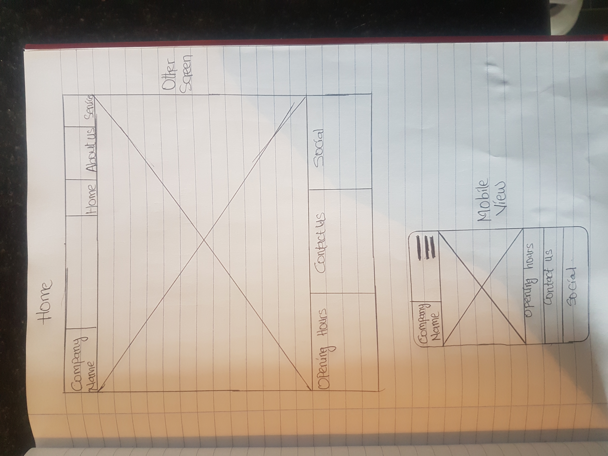
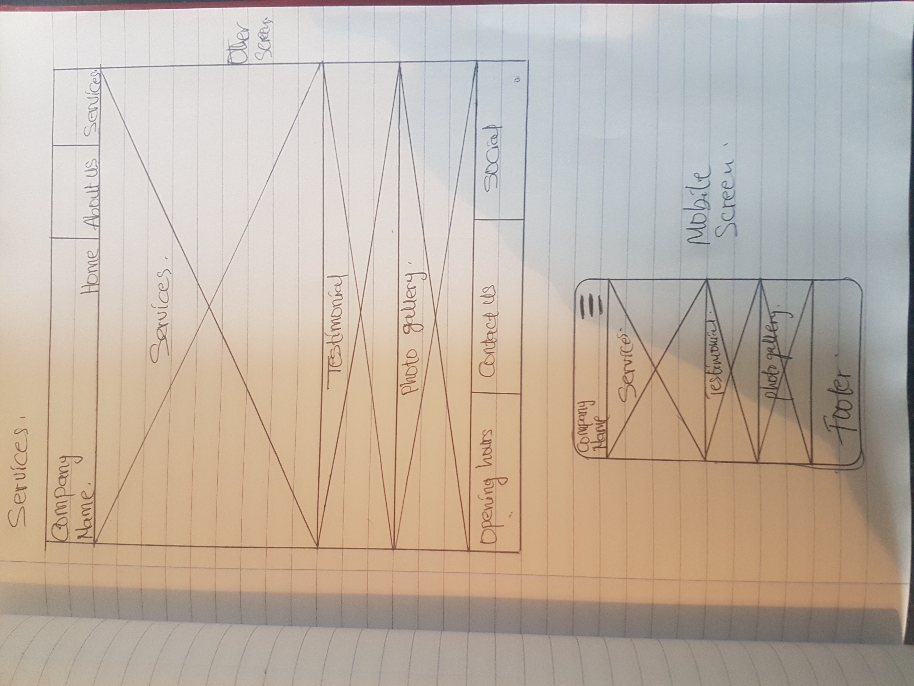

# **ES-car-wash--MS1-project**
The inspiration for this project came from my experience of working with a Valeting company some years ago. This is an imaginary website built to enable anyone who wants to clean their cars able to see the type of services we render and be able to book online inorder to reduce the waiting time to clean their cars.
# **UX**
This site was designed with mobile first approach in mind. The pages were designed so that it can be easy to navigate. The images and color used was to make it more eye catchy.
I identified two(but are not limited to) users of this website:
* New customers.
* Existing customers.
### **user stories**

* As a new customer I should be able to see the type of services rendered, opening hours, contact, photo gallery and online reviews.
* As an existing customer I should be able to book an appointment online.

## **Wireframes**
### **Home page**

### **about page**

### **services page**

## **features**
* **Navigation Bar** - This allows users to easily navigate through the  site, it is easy to use and it is consistent throughout the site.
* **Book Appointment form** - This allows users to book appointment online for the type of service they want.
* **Footer Link** - This allows users to link with the the company's social media pages, Opening hours and contact details. It is also consistent throughout the site.
* **About us page** - This contain information about the company and team members.
* **Card** - This contain the type of services carried out and the prices for each services.
* **Testimonial** - This contain information of what people are saying about the company.
* **Carousel** - This allows the user to see images of previous job done.
## **future features**
* Embed a google map.
* Add a contact us form.

## **Technology used**
[HTML](https://https://en.wikipedia.org/wiki/HTML5) - HTML5 provided the structure and content of my site.

[CSS](https://https://en.wikipedia.org/wiki/Cascading-style-sheet) - CSS provided the styling.

[Bootstrap](https://https://getboostap.com) - Bootstrap framework was used for the layout and responsive design of my pages. It was also used for the images, cards and carousel.

[Google fonts](https://fonts.google.com) - I used Roboto for all the headings and Exo for the paragraph text.

[Font awesome](https://fontawesome.com) - I used icons from font awesome to style some element on my footer.

[Gitpod](https://gitpod.io) - This is the text editor I used.

[Git](https://git-scm.com) - This was used as a version control to store my work whenever I make any relevant changes.

[Github](https://github.com) - This is where my repository is stored externally and also used to deploy my website.

[Javascript/jQuery](https://jquery.com/) - This was imported from bootstrap to create a responsive collapsible Nav bar on smaller screen.

## **Testing**
## **Deployment**
My site is hosted on github, and it can be accessed from the link: https://github.com/source-code88/ES-car-wash--MS1-project.git

## **Credits**
### **Content**
* The code for the body of the home page was gotten from https://startbootstrap.com/themes/creative
* The text for the service section were taken from http://rabbitcarwashvaleting.ie/full-car-valet/
* The colors for the pages were gotten from  http://colormind.io/

### **Media**
* Home background image:(https://www.recruiter.co.uk/sites/default/files/media/image/2017/web_hand-car-wash_istock-174964190.png)
* About us background image: https://www.inside.unsw.edu.au/sites/default/files/article/carwash750x400.png)
* https://www.pexels.com/search/car%20wash/ 
* https://startbootstrap.com/themes/
* The images were resized using http://tinypng.com/ and http://img-resize.com

### **Acknowledgement**
* To my mentor Reuben Ferrante and the slack community at code institute for guiding and point me in the right direction during the course of this project.